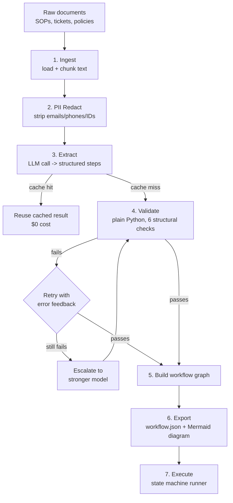

# Architecture

## Pipeline overview

## Stage-by-stage

| Stage | File | What it does | Decision points |
|---|---|---|---|
| Ingest | `src/ingest.py` | Loads documents, chunks long ones | Chunk if doc > 6000 chars |
| Redact | `src/pii_redact.py` | Strips PII before any LLM call | N/A (always applied) |
| Extract | `src/extractor.py` | LLM turns text into structured steps | Cache hit? Model tier (mini vs full)? |
| Validate | `src/workflow_builder.py` | Checks structural correctness | Pass / retry / escalate |
| Build | `src/workflow_builder.py` | Wraps valid steps into a graph object | N/A |
| Export | `src/cli.py`, `src/diagram.py` | Writes `workflow.json` + Mermaid `.mmd` | N/A |
| Execute | `src/executor.py` | Runs the workflow, proves it's operable | Branch choice at decision points |

## Why extraction and validation are separate stages

This is the single most important design decision in the project, and it's
worth being able to explain clearly:

- **Extraction** (LLM's job) is inherently uncertain — the model is reading
  natural language and inferring structure. It can make mistakes.
- **Validation** (plain Python) is deterministic — "does every step have a
  path to an end state?" is a yes/no question that doesn't need an LLM to
  answer, and costs nothing to check.

By keeping these separate, we can:
1. Test validation exhaustively and for free (see `tests/test_workflow_builder.py`).
2. Give the LLM structured feedback ("step X has no outgoing transition") and
   ask it to fix just that, instead of re-explaining the whole task.
3. Escalate to a stronger model only when the cheap model genuinely can't
   produce valid output after a retry — not on every call.

## Why the output looks BPMN-like

`workflow.json` has `states`, `transitions`, and `guard` conditions on each
transition. This maps directly onto concepts real automation engines already
use (Camunda, AWS Step Functions, Temporal), so a real "automation engineer"
could take this JSON and translate it into their engine's format without
having to reverse-engineer a bespoke schema.
